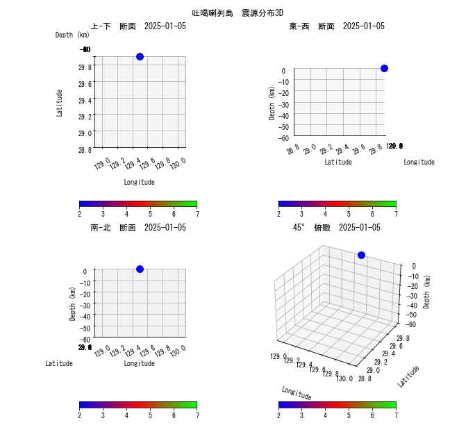

这个项目利用matplotlib对地震震源信息进行3D可视化

* 语言

python 3.10

* 模块

matplotlib 3.10

* 视觉效果  
  

* 基本功能
  * 数据收集
  [日本气象机构](https://earthquake.tenki.jp/bousai/earthquake/center/798/ "地震信息")  
  调查页面数可以在代码"tokara\_islands.py"里通过变量"PAGES"指定，此处指定21页。  
  执行方式:  
    python tokara\_islands.py  
  执行结果:  
    取得后的数据以"data\_in\_XXpages.csv"的方式保存到"data"文件夹，XX是设定的页数  

  * 数据预处理
  收集的数据不适合直接用来进行可视化，需要适当处理，抽取数值，改变类型，增加辅助数据  
  处理后起始年份可以在代码"data\_process.py"里通过变量"YEAR\_FROM"指定，此处指定2025年。  
  输入数据在"YEAR\_FROM"后面，"read\_csv"函数里指定。  
  执行方式:  
    python data\_process.py  
  执行结果:  
    从"data\\data\_in\_XXpages.csv"读入数据，处理后的数据存入"data\\data\_YYYY\_formatted.csv"数据，YYYY是起始年份。  

  * 数据可视化
  函数"plot\_4\_images"生成静态全体数据图。  
  函数"plot\_animation"生成时间序列的日单位动态图。  
  切换执行函数需要修改代码里"\_\_main\_\_"。  
  输入数据在"plot\_3d\_undergrand.py"里，通过"filter\_data"函数读入指定。  
  函数参数"dt\_cond"可以指定实际可视化时从什么时间点开始作图。  
  执行方式:  
    python plot\_3d\_undergrand.py  
  执行结果:  
    从"data\\data\_YYYY\_formatted.csv"读入数据，可视化后的数据，  
    静态图保存为"depth\_magnitude\_diff\_bands.png"，  
    动态图保存为同名GIF文件。  
